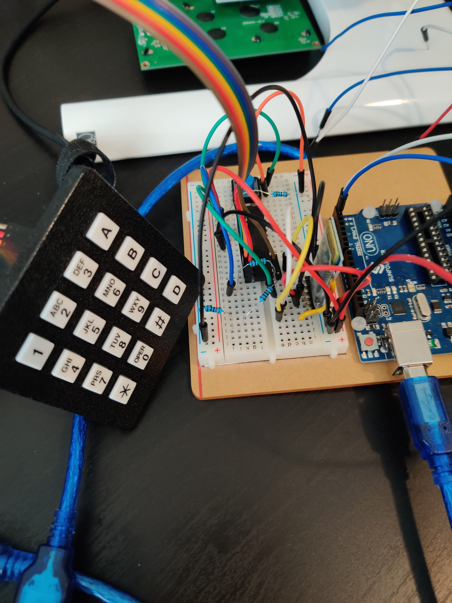
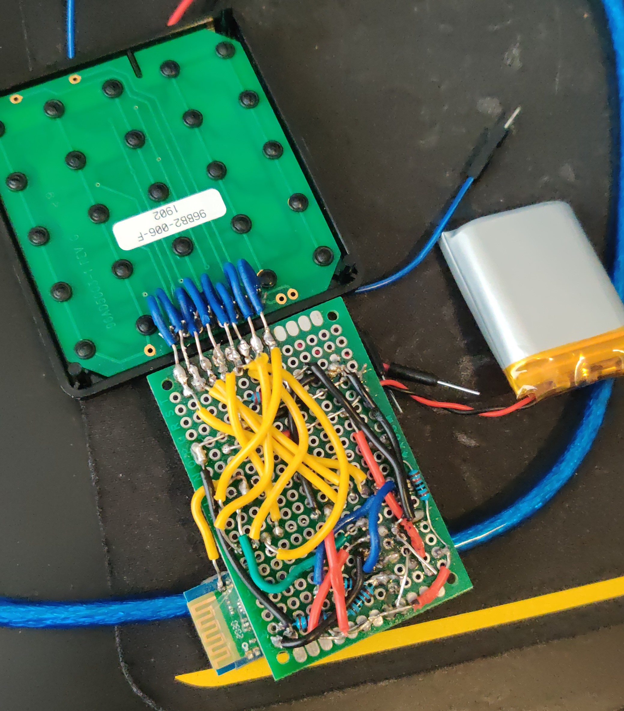
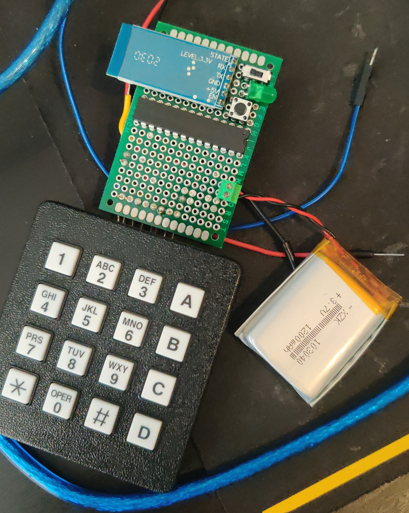
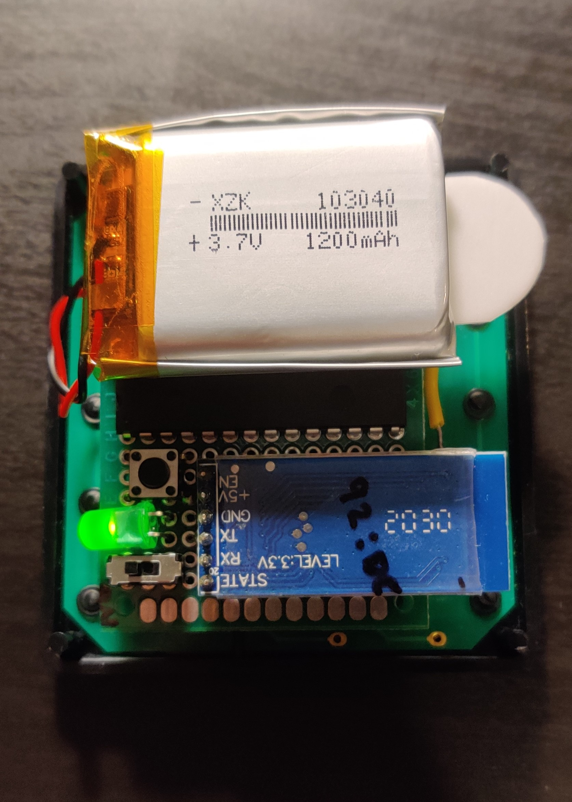
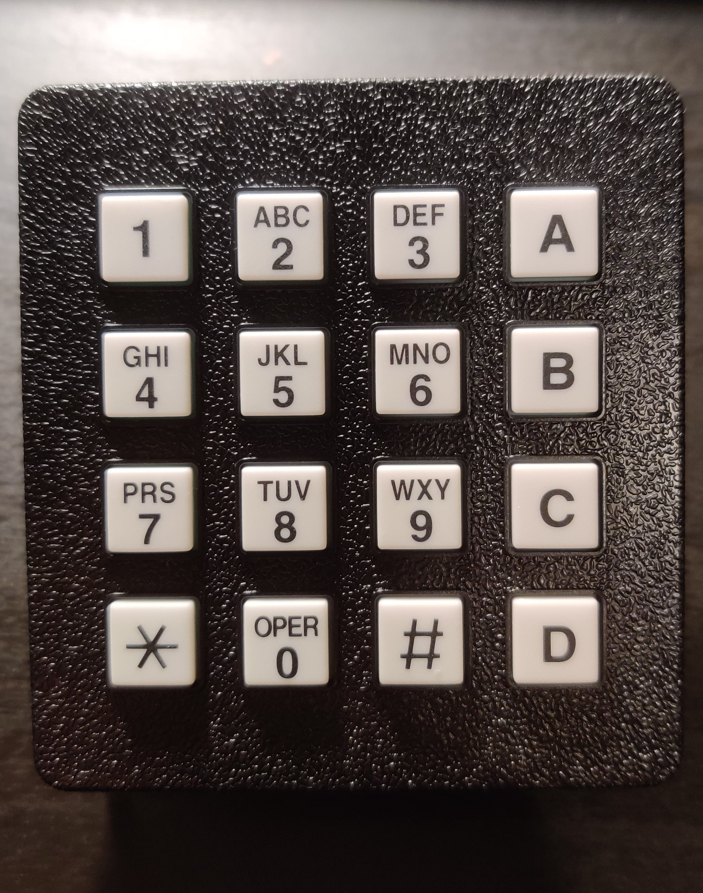

# Bluetooth Keypad Project #

## Motivation ##
This project was created with the simple idea of making a bluetooth keypad. Specific measures were taken in order to make the device compact, battery operated, have low power consumption.

## Project Details ##
This project began as a simple Arduino project, and has evolved into a C++ library for HC-05 bluetooth communication and control. Functionality has been built almost entirely from scratch using C++/Arduino compatible code. Custom code was written to: update/reset bluetooth configurations on-demand, send/receive and parse JSON formatted packet data, and interpret user keypad presses. The following libraries were used:
 - ArduinoJSON
 - EnableInterrupts
 - SoftwareSerial

## Parts and Materials ##
 - ATmega328p micro-processor (or Arduino Nano/Uno)
 - HC-05 Bluetooth Module
 - 3.7v LiPO battery
 - 4x4 keypad
 - wires, protoboard, button, switch, LED

## Power Consumption ##
As mentioned, specific consideration was given to reducing power consumption of the device and allow for battery operation. The following chart shows the progression of power consumption optimization:

| Optimization | mA (BT searching) | mA (BT connected & Idle) | mA (BT connected & Transmitting) |
|--------------|-------------------|--------------------------|----------------------------------|
| None         |        50mA       |            30mA          |                40mA              |
| + Config IPSCAN | __12mA__ | 30mA | 40mA
| + Master/Follower role switching | 12mA | __24mA__ | __30 mA__
| + use ATmega328p (instead of Arduino Nano/Uno) | 12mA | __20mA__ | __25mA__
| + MCU sleep | 12mA | __10mA__ | 25mA

## Features ##
This portable bluetooth keypad can connect to any bluetooth device as a follower, and send keypad presses OTA. Additionally, using a second HC-5 module, this BT keypad device can receive updated configuration settings that can control connection mode (master/follower), baudrate, factory reset, IP scanning intervals, device name, etc.

As mentioned, power consumption was heavily factored into the design of this device. Optimizations were done to reduce avg current consumption from ~40mA to ~10mA. Techniques were used such as: using low power devices, adding idle and sleep logic into the micro-processor, using a switch to cut/enable power to the entire system, as well as complex logic to switch the HC-05 BT module from follower to master when being paired with a second HC-05. A BT module connecting as a master actually consumes less power. This is because the master controls all the timings and data transmission windows allowing it to save power in between activity; whereas a follower must always be listening for it's paired master sending data.

Holding the 0 (zero) key while reseting the device (push button on the back) will factory reset the HC-05 BT module. This allow for easier configuration, and any other BT devices to easily connect to it. Additionally, pressing # on device reset will put the BT module into configuration listening mode, where another HC-05 module can send it JSON formatted commands to setup/change the current configuration.

## Images ##

### Prototype:

### Soldered board (backside):

### Soldered board (frontside):

### Complete (backside):

### Complete (frontside):

## Usage/Setup ##
In order to have this project be Arduino IDE and Visual Studio Code compatible, the Arduino code files (`*.ino`) are found in the `exmaples/` directory. In order to Compile and Upload the sketch you must copy/move the `*.ino` file to the root directory.

You must also verify that the correct settings are active in the `src/settings.h` file. This ensures that the proper functionality is compiled for the specific functions you intend.